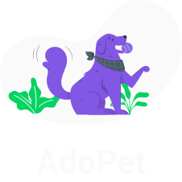

<h4 align="center">
   
</h4>

## About
Adopet is a platform where users can share cases of abandoned animals or animals available for adoption. Its goal is to reduce cases of animal abandonment during the Covid-19 pandemic. This project was developed during the Code/Station Hackathon, an event held by Rocketseat and Shawee.

## Libraries and Tools (front-end)
  - NextJS;
  - ChakraUI;
  - Axios;
  - React Hook Form;
  - Yup;
  - Nookies;
  - React Query;
  - Jest and Testing Library;
  - a lot of love :heart:;
  
## Back-end
The project has a back-end made in NodeJS, also developed as part of the Code/Station Hackathon challenge. See the [repository](https://github.com/luispaulopinto/adopet-server). 
